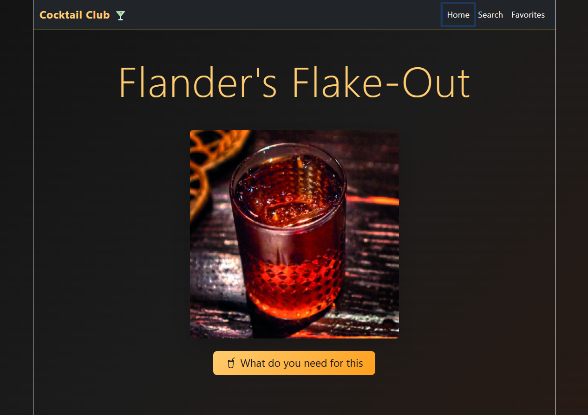

Cocktail Club on kokteiliretseptide leht, kus kasutaja saab:
 - juhuslikke kokteilide pilte, mille kohta saab huvi korral avada detailse vaate koostisosade ja valmistusjuhendiga 
 - meeldiva retsepti lisada lemmikute/Favorites nimekirja 
 - favorites nimekirjast kokteile eemaldada või avada detailset vaadet koostisosade ja valmistusjuhendiga
- otsida kokteile nime järgi

Leht on integreeritud Cocktail APIga, sellel on otsingufunktsioon, detailivaade, localStorage'isse salvestamine Favorites nimekirjas, responsive disain, React Router navigeerimine.

Lehel kasutatud tehnoloogiad: 
React, TypeScript, Vite, Bootstrap, React Router, TheCocktailDB API (https://www.thecocktaildb.com/api.php)

Live leht asub:

https://kerly1000.github.io/cocktailclub/

Installeerimine: 
Repositooriumi kloonimiseks: 
git https://github.com/kerly1000/cocktailclub.git 

npm install
npm i react
npm i react-dom

Kohalikus serveris avamiseks:
npm run dev

